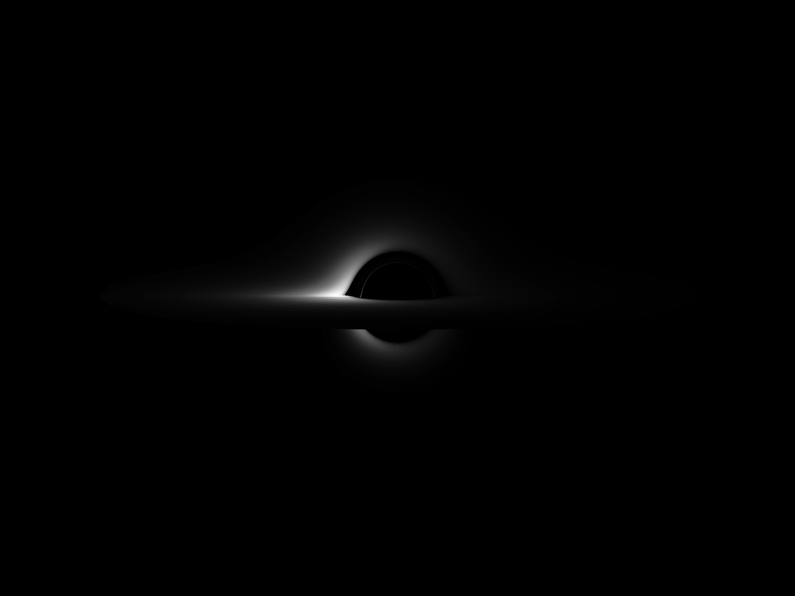

<div align="center">
  
# Luminet
    

Simulate and visualize Swarzschild black holes, based on the methods described in Luminet (1979).


</div>
  
# Installation

This project uses [`pixi`](https://pixi.sh/latest/) for installation and dependency management.
To activate the environent, simply run `pixi shell` in this directory.

# Usage

All variables in this repo are in natural units: $G=c=1$

```python
>>> from black_hole import BlackHole
>>> bh = BlackHole(
...     mass=1,
...     incl=1.5,           # inclination in radians
...     acc=1,              # accretion rate
...     outer_edge=40)
```
To create an image:
```python
>>> ax = bh.plot()          # Create image like above
```

To sample photons on the accretion disk:
```python
>>> bh.sample_photons(100)
>>> bh.photons
radius  alpha   impact_parameter    z_factor    flux_o
10.2146 5.1946  1.8935              1.1290      1.8596e-05
... (99 more)
```

Note that sampling is biased towards the center of the black hole, since this is where most of the luminosity comes from.


# Background
Swarzschild black holes have an innermost stable orbit of $6M$, and a photon sphere at $3M$. This means that
the accretion disk orbiting the black hole emits photons at radii $r>3M$. As long as the photon perigee in curved space remains larger than $3M$, the photon is not captured by the black hole, and can in theory be seen from an observer frame $(b, \alpha)$. The spacetime curvature is most easily interpreted as a lensing effect between the black hole frame $(r, \alpha)$ and the observer frame $(b, \alpha)$. The former are 2D polar coordinates that span the accretion disk area, and the latter are 2D polar coordinates that span the "photographic plate" of the observer frame. Think of the latter as a literal CCD camera. The photon orbit perigee and the radius in observer frame $b$ are directly related:

$$b^2 = \frac{P^3}{P-2M}$$

This makes many equations significantly more straightforward. 
You may notice this equation has a square on the left hand side, in contrast to Luminet (1979). The original manuscript has a handful of notation errors. I've contacted the author about this, to which he kindly responded:

> "[...] à l’époque je n'avais pas encore l’expérience de relire très soigneusement les épreuves. Mais mes calculs avaient  heureusement été faits avec les bonnes formules, sinon le résultat visuel n’aurait pas été correct!" 
>
>"Back in the day, I did not have the habit of carefully double-checking my proofs. Luckily, I did calculate the results with the correct formulas, otherwise the image wouldn't be right!".

Just so you know. I tried to be diligent about noting where this code differs from the paper. 

The relationship between the angles of both coordinate systems is trivial, but the relationship between the radii in the two reference frames is given by the monstruous Equation 13:

$$\frac{1}{r} = - \frac{Q - P + 2M}{4MP} + \frac{Q-P+6M}{4MP}{sn}^2\left( \frac{\gamma}{2}\sqrt{\frac{Q}{P}} + F(\zeta_\infty, k) \right)$$

Here, $F$ is an incomplete Jacobian elliptic integral of the first kind, $k$ and $Q$ are a function of the perigee $P$, $\zeta$ are trigonometric functions of $P$, and $\gamma$ satisfies:

$$\cos(\gamma) = \frac{\cos(\alpha)}{\sqrt{\cos^2\alpha + \cot^2\theta_0}}$$

In curved spacetime, there is usually more than one photon orbit that originates from the accretion disk, and arrives at the observer frame. Photon orbits that curve around the black hole and reach the observer frame are called "higher order" images, or "ghost" images. In this case, $\gamma$ satisfies:

$$2n\pi - \gamma = 2\sqrt{\frac{Q}{P}} \left( 2K(k) - F(\zeta_\infty, k) - F(\zeta_r, k)  \right)$$

This repo uses `scipy.optimize.brentq` to solve these equations, and provides convenient API to the concepts presented in Luminet (1979). The `BlackHole` class is the most obvious one, but it's also educative to play around with e.g. the `Isoradial` class: lines in observer frame describing photons emitted from the same radius in the black hole frame. The `Isoredshift` class provides lines of equal redshift in the observer frame.

# Bibliography
[1] Luminet, J.-P., [“Image of a spherical black hole with thin accretion disk.”](https://ui.adsabs.harvard.edu/abs/1979A%26A....75..228L/abstract), <i>Astronomy and Astrophysics</i>, vol. 75, pp. 228–235, 1979.

[2] J.-P. Luminet, [“An Illustrated History of Black Hole Imaging : Personal Recollections (1972-2002).”](https://arxiv.org/abs/1902.11196) arXiv, 2019. doi: 10.48550/ARXIV.1902.11196. 
